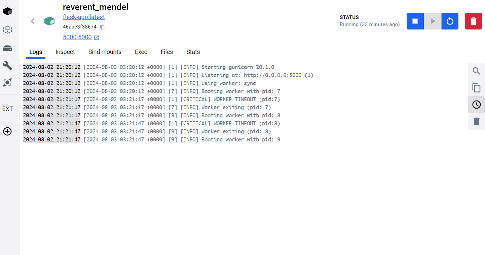
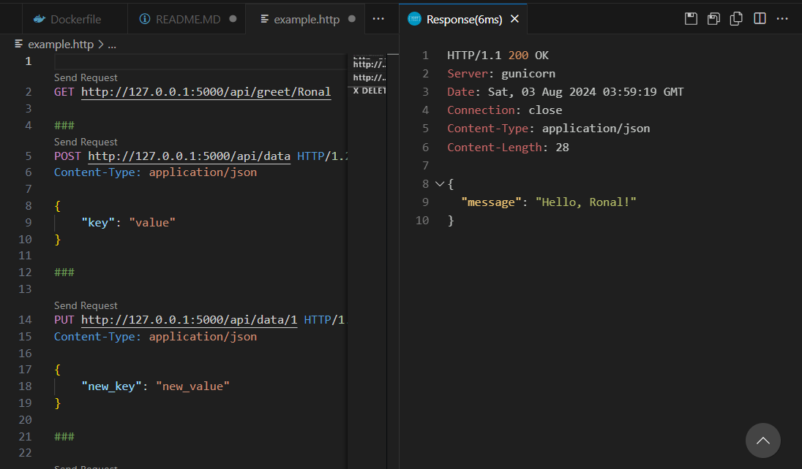
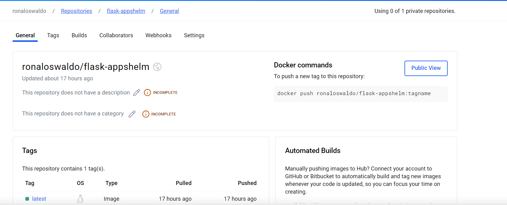
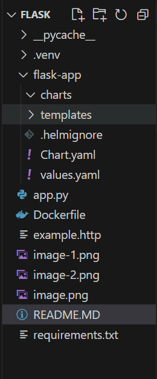
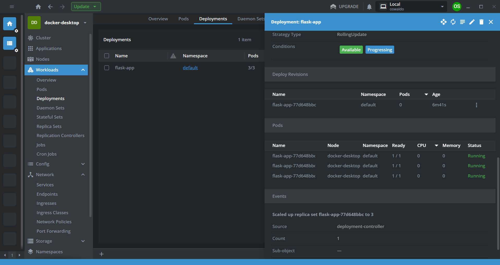
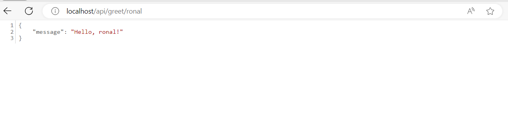

# Primeros pasos con Helm y no morir en el intento 


# Prerequisitos 

Instalar docker desktop segun su sistema operativo  https://docs.docker.com/desktop/install/windows-install/
Instalar kubernetes https://www.docker.com/blog/how-kubernetes-works-under-the-hood-with-docker-desktop/ , https://kubernetes.io/docs/tasks/tools/install-kubectl-windows/
Instalar Helm https://helm.sh/docs/intro/install/

# Creacion de una API con Flask y gunicorn

```bash
(.venv) PS C:\Users\RonalGonzalez\Desktop\flask> dir


    Directory: C:\Users\RonalGonzalez\Desktop\flask


Mode                 LastWriteTime         Length Name
----                 -------------         ------ ----
d-----          8/2/2024   6:25 PM                .venv
da----          8/2/2024   6:33 PM                __pycache__
-a----          8/2/2024   9:09 PM            796 app.py
-a----          8/2/2024   9:11 PM            713 Dockerfile
-a----          8/2/2024   9:10 PM            304 requirements.txt

```

#### ./flask/app.y 

```python 
from flask import Flask,request,jsonify

app = Flask(__name__)

@app.route("/")
def hello_world():
    return "<p>Hello, World!</p>"


@app.route("/api/greet/<name>", methods=["GET"])
def greet(name):
    return jsonify({"message": f"Hello, {name}!"})

@app.route("/api/data", methods=["POST"])
def create_data():
    data = request.get_json()
    return jsonify(data), 201

@app.route("/api/data/<int:data_id>", methods=["PUT"])
def update_data(data_id):
    data = request.get_json()
    return jsonify({"id": data_id, "data": data})

@app.route("/api/data/<int:data_id>", methods=["DELETE"])
def delete_data(data_id):
    return jsonify({"message": f"Data with id {data_id} has been deleted"}), 204

if __name__ == "__main__":
    app.run(host="0.0.0.0", port=5000)


```

#### ./flask/Dockerfile

```Dockerfile 
# Usar una imagen base oficial de Python
FROM python:3.9-slim

# Establecer el directorio de trabajo en el contenedor
WORKDIR /app

# Copiar el archivo de requerimientos al contenedor
COPY requirements.txt requirements.txt

# Instalar las dependencias
RUN pip install -r requirements.txt

# Verificar la instalación
RUN pip show gunicorn flask

# Copiar el contenido de la aplicación al contenedor
COPY . .

# Establecer la variable de entorno para que Python no genere archivos .pyc
ENV PYTHONUNBUFFERED=1

# Exponer el puerto que usará la aplicación Flask
EXPOSE 5000

# Definir el comando por defecto para ejecutar la aplicación
CMD ["gunicorn", "-b", "0.0.0.0:5000", "app:app"]
```

### ./flask/requirements.txt

```txt
blinker==1.8.2
click==8.1.7
colorama==0.4.6
Flask==3.0.3
itsdangerous==2.2.0
Jinja2==3.1.4
MarkupSafe==2.1.5
Werkzeug==3.0.3
gunicorn==20.1.0

```

### Construir container Dockerfile 

```bash
docker build -t flask-app .  
```

### Exponer nuestra API flask 
```bash
docker run -p 5000:5000 flask-ap
```


# Ver la imagen Docker 



# Testing API with extension REST Client

https://marketplace.visualstudio.com/items?itemName=humao.rest-client




# Push Docker Image a Docker Hub

 Si la imagen no se construyó con el nombre y etiqueta correctos, puedes etiquetarla manualmente:
 Reemplaza <IMAGE_ID> con el ID de la imagen que obtienes al construirla. Puedes encontrar el ID de la imagen ejecutando docker images.


```bash
docker tag <IMAGE_ID> ronaloswaldo/flask-appshelm:latest
```


Hacer Push de la Imagen
Realiza el push de la imagen a Docker Hub:

```bash
docker push ronaloswaldo/flask-appshelm:latest
```





# Crear un con Helm Chart 

```bash 
helm create flask-app
```



# Configuracion del archivo Values.yaml 

```yaml
# Default values for flask-app.
# This is a YAML-formatted file.
# Declare variables to be passed into your templates.

replicaCount: 3

image:
  repository: ronaloswaldo/flask-appshelm
  pullPolicy: IfNotPresent
  # Overrides the image tag whose default is the chart appVersion.
  tag: "latest"


service:
  type: LoadBalancer
  port: 80
  targetport: 5000

```

# Configurar y exponer el archivo services

En esta configuracion solo es necesario agregar el nuevo valor que es el targetport por que por default es http en
este caso en el archivo de configuracion value agregue un targetPort  

```yaml
apiVersion: v1
kind: Service
metadata:
  name: {{ include "flask-app.fullname" . }}
  labels:
    {{- include "flask-app.labels" . | nindent 4 }}
spec:
  type: {{ .Values.service.type }}
  ports:
    - port: {{ .Values.service.port }}
      targetPort: {{ .Values.service.targetPort }}
      protocol: TCP
      name: http
  selector:
    {{- include "flask-app.selectorLabels" . | nindent 4 }}
```

# Instalar nuestro Heml creado 


```bash
helm install flask-app .\flask-app 
```
output
```bash
NAME: flask-app
LAST DEPLOYED: Sat Aug  3 16:45:19 2024
NAMESPACE: default
STATUS: deployed
REVISION: 1
NOTES:
1. Get the application URL by running these commands:
     NOTE: It may take a few minutes for the LoadBalancer IP to be available.
           You can watch its status by running 'kubectl get --namespace default svc -w flask-app'
  export SERVICE_IP=$(kubectl get svc --namespace default flask-app --template "{{ range (index .status.loadBalancer.ingress 0) }}{{.}}{{ end }}")
  echo http://$SERVICE_IP:80
```

# Vemos si esta todo correcto 

#### utilizo lens para ver las configuraciones si esta correcta mas que todo los deployment si hubo algun error 


#### Ahora es de verificar la APIs y vemos que ya funciona 
